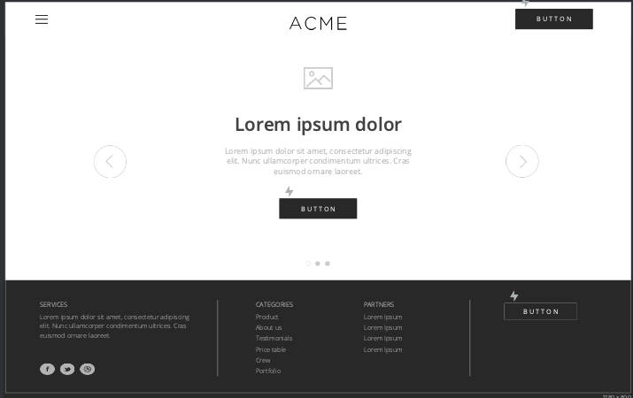
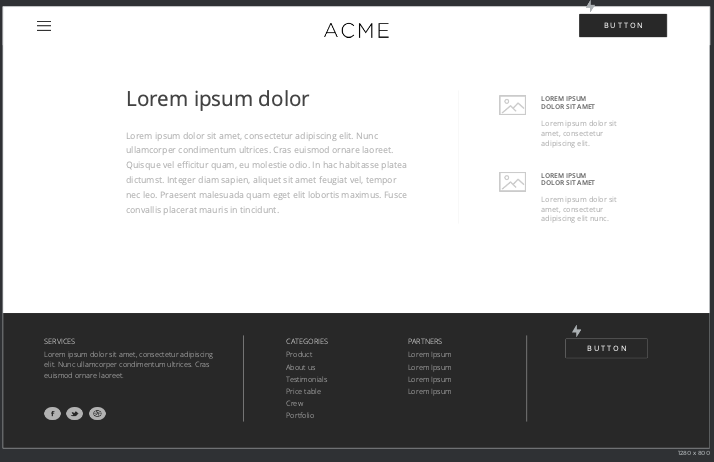

# Project1_GW

Team: Ace of Pentacles

Description: Tarot card reader app with astrology functions.

Tasks - 

Rachel - CSS/HTML/Javascript/if/else/project management

Frankie - CSS/HTML/Javascript/if/else

Amir - Javascript/Local storage master/APIs)

Johnnie - Javascript (for loops/Arrays/If/Else master/APIs)

Young - Linter/Javascript

APIs:

Astrologer API - https://astrologyapi.com/

Github APIs - see slack
    - https://github.com/howlCode/tarot_api
    - https://github.com/ekelen/tarot-api
    - https://github.com/howlCode/tarot_api

Mapping API/Searching Yelp API - 
Rapid API - https://rapidapi.com/ine0nite/api/astrology-horoscope/endpoints

