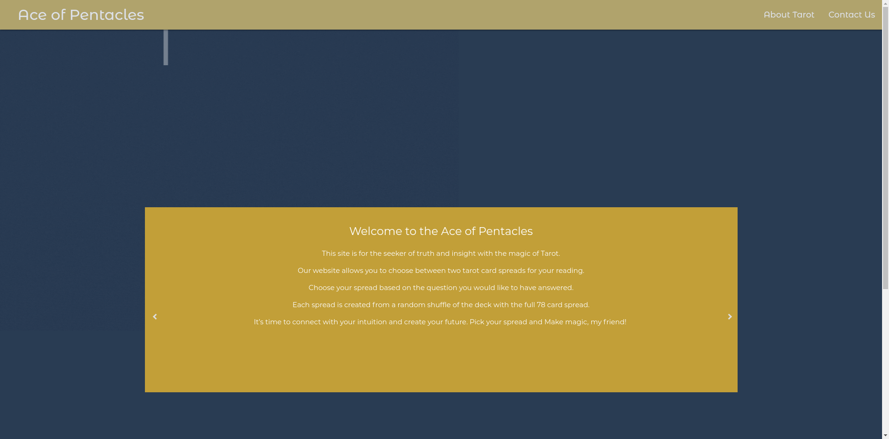
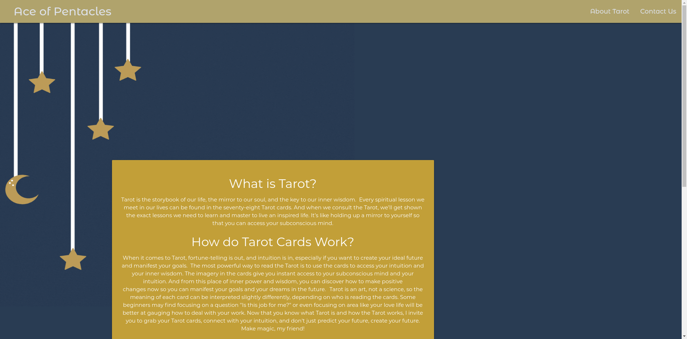
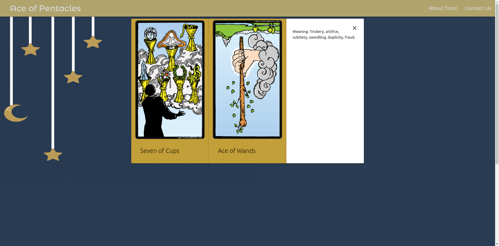
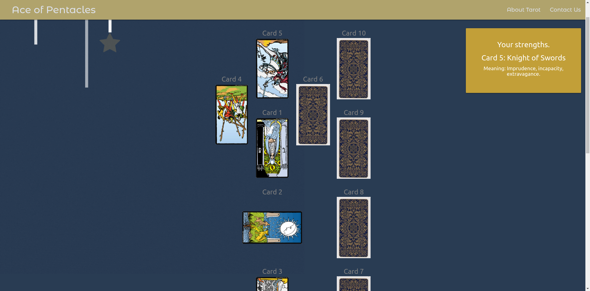
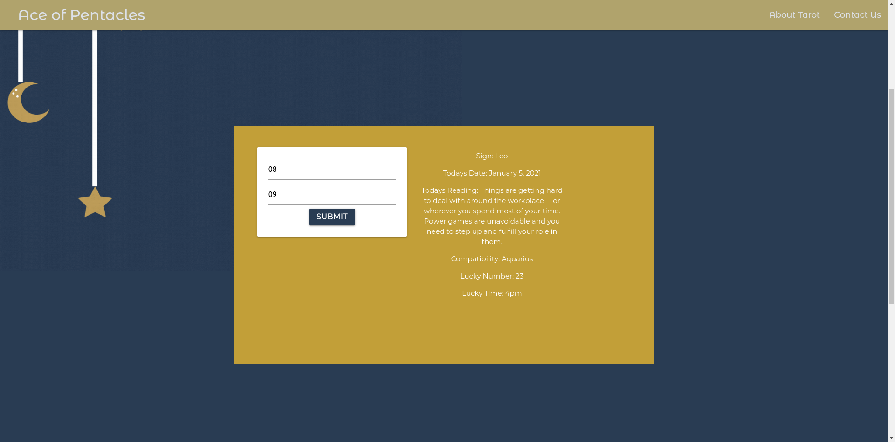
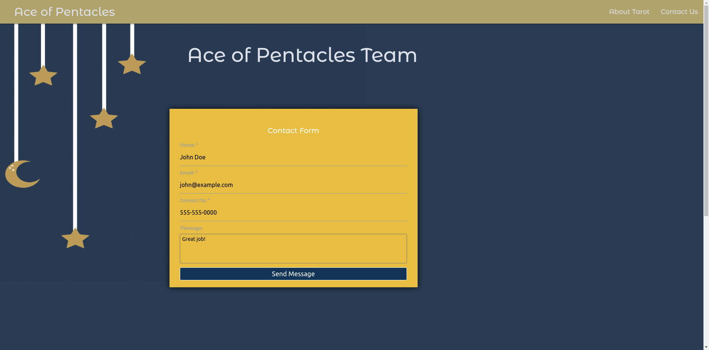
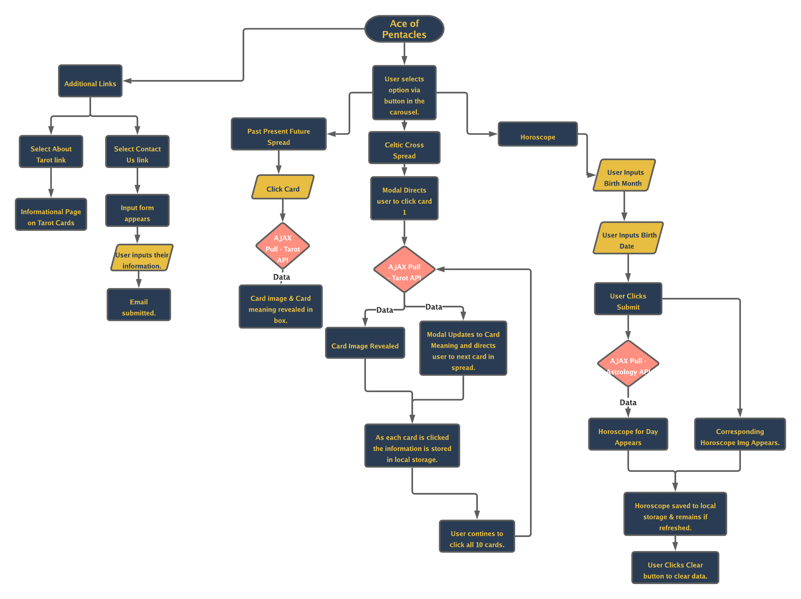

# Ace of Pentacles

Ace of Pentacles is a tarot reading and astrology application utilizing RESTful APIs to provide dynamic insights for users. 

[Project Links]

Deployed application: https://rwanke14.github.io/AceOfPentacles/ 

Github repo: https://github.com/rwanke14/AceOfPentacles 

[Project Screenshots]

[User Instrucctions and Program Logic]

Ace of Pentacles is a tarot and astrology application utiliizing two APIs: 

Tarot API: https://github.com/ekelen/tarot-api 

Astrology API: https://rapidapi.com/sameer.kumar/api/aztro 

On opening the application, the user is shown a welcome slide. The user can click on arrow buttons on either side of the slide to swap slides. Three available slides to select: Past/Present/Future Spread, Celtic Cross Spread, and Horoscope. Each slide contains a button which when clicked will send the user to the respective page. 

Past/Present/Future Spread: 

User is presented with three facedown cards representing Past conditions, Present conditions, and Future conditions, respectively. On clicking the facedown card, a tarot card is randomly generated and revealed to the user. User can then click on the revealed card to bring up a slide providing the card's meaning. 

Celtic Cross Spread: 

Spread contains 10 cards. User clicks each facedown card in the provided numerical order, which randomly generates a card and reveals it. A text box on the right side of the screen provides card meaning. Clicking on a card again redisplays that card's meaning.

Horoscope: 

User is presented with an interactive submission box. Required fields are: Birth Month (MM) and birth day (DD). User enters required info and clicks Submit. User is presented with the current date, their Zodiac sign, and their horosocpe. User info is stored in local storage. Upon reloading the page, user is provided the new daily horoscope by default based on their previously entered information.

About Tarot:

Information for the user, explaining the tarot and its uses. 

Contact Page:

Contact form if user wishes to contact the developers. 

[Contributors]

Rachel Wanke - CSS/HTML/Project Management

Frankie Rosado - CSS/HTML/Design

Amir Ashtiany- Javascript/Local Storage/API/Horoscope Page

Johnnie Simpson- Javascript/API/Card Spreads

Young Ji Kim- Linter/Javascript/API/Celtic Cross Spread & CSS

[Developers Contact]

1. Amir Ashtiany - https://github.com/Alexfit4
2. Young Ji Kim - https://github.com/youjmi
3. Frankie Rosado - https://github.com/Franciscorosado09
4. Rachel Wanke: - https://github.com/rwanke14 
5. Johnnie Simpson - https://github.com/balokdecoy

[Acknowledgments]

Thanks to Github user E Kelen for the Tarot card API. Visit E Kelen's Github page at: https://github.com/ekelen 

Thanks to Sameer Kumar for the Horoscope API. Visit their RapidAPI profile at: https://rapidapi.com/user/sameer.kumar 

Thanks to Boris Kladov for providing the base getZodiacSign() function, which was modified for our purposes. Visit his Github profile at: https://gist.github.com/kladov 

Thanks to Lena Helfinger for providing images for Horoscopes.  https://pixabay.com/users/lenahelfinger-15629841/

Thank to Formget and medium for basics of Contact US form : https://www.formget.com/jquery-contact-form/  and https://medium.com/getform-all-about/how-to-create-an-html-form-that-sends-you-an-email-c89068ffa76e

Materialize for CSS https://materializecss.com/

